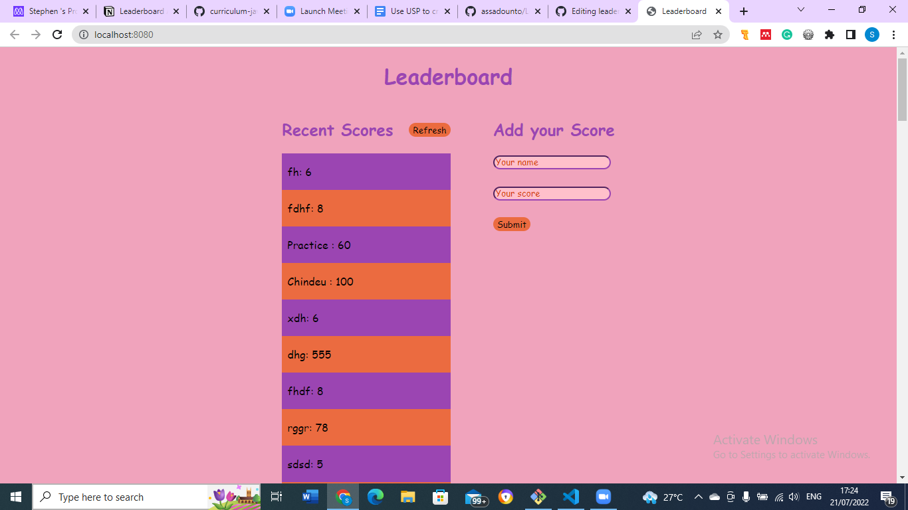

## Project Name 
Leaderboard

## Project Description
In this project I utilized
- webpack to bundle JavaScript.
- ES6 syntax to build leaderboard.
- ES6 modules to write modular JavaScript.
- Use callbacks and promises.

## Built With
- HTML
- CSS
- Javascript 
- Webpack
- API

## Deployment

[Live view](https://stephnna.github.io/leaderboard/dist/)

## Getting Started

The goal of this project is to:
In this project I setup up a JavaScript project for the Leaderboard list app, using webpack and ES6 features, notably modules. I developed a first working version of the app following a wireframe, but without styling. I consumed the Leaderboard API using JavaScript async and await and added some styling.

## Authors
👤 Ezea Stephen Nnabuike
- GitHub: [@stephnna](https://github.com/stephnna)
- Twitter: [@stephnna](https://twitter.com/stephnna)
- LinkedIn: [Linkedin](https://www.linkedin.com/in/stephen-nnabuike-ezea-143b97170/)

## Prerequisites
- Have a good knowledge on how to parse UI designs
- Have VSCode or other text editor installed. [Link to download VSCode](https://code.visualstudio.com/download)
- Install node package. [Link to download node](https://nodejs.org/en/download/)
- Have git installed.[Link to download git](https://git-scm.com/downloads)
- Create a github repository.

## Setup
- `git clone git@github.com:assadounto/Leader-board.git`
- `cd leader-board/`
- Install packages:  `npm install`
- Start Live Server: `npm run dev`

-Follow the HTML-CSS linter confuguration to docs to setup linters [Link to Microverse linter docs](https://github.com/microverseinc/linters-config)

## Run tests

For tracking linters errors locally, you need to follow these steps:
- For tracking linter errors in HTML file run:

1. `npm install --save-dev hint@6.x`
2. `npx hint .`

- For tracking linter errors in CSS file run:

1. `npm install --save-dev stylelint@13.x stylelint-scss@3.x stylelint-config-standard@21.x stylelint-csstree-validator@1.x`
2. `npx stylelint "**/*.{css,scss}"`

- For tracking linter errors in Javascript file run:

1. `npm install --save-dev eslint@7.x eslint-config-airbnb-base@14.x eslint-plugin-import@2.x babel-eslint@10.x`
2. `npx eslint .`

- Consume the API
[Follow this Link](https://www.notion.so/Leaderboard-API-service-24c0c3c116974ac49488d4eb0267ade3)

## 🤝 Contributing

Contributions, issues, and feature requests are welcome!

Feel free to check the [issues page](../../issues/).

## Show your support

Give a ⭐️ if you like this project!

## Acknowledgments

- Hat tip to anyone whose code was used
- Inspiration
- etc

## 📝 License

This project is [MIT](./MIT.md) licensed.
